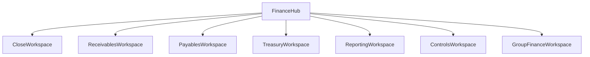

# Finance Workspace Roadmap

## Goal
Reorganize finance, treasury, reporting, and controls into live workspaces that reflect how finance teams actually operate, instead of exposing a broad set of routes with mixed levels of readiness.

## Current Navigation Problem
The current finance surface is broad but fragmented:
- overlapping entry points for AR/AP and finance
- a mix of live pages and placeholders
- no explicit close workspace
- no group-finance workspace
- no issue-driven control center for reconciliation, approvals, or reporting exceptions

Navigation anchor:
- [erp-odaflow/src/config/navigation/sections.ts](/Users/v/Desktop/Apps/ERP/erp-odaflow/src/config/navigation/sections.ts)

## Recommended Workspace Model

## Workspace Definitions
### 1. Close Workspace
Purpose:
- close calendar
- close checklist
- open blockers
- period status
- adjustments and reversals
- signoff trail

Current anchors:
- [erp-odaflow/src/app/(dashboard)/finance/period-close/page.tsx](/Users/v/Desktop/Apps/ERP/erp-odaflow/src/app/(dashboard)/finance/period-close/page.tsx)

### 2. Receivables Workspace
Purpose:
- overdue queue
- unapplied cash
- allocations
- disputes and write-offs
- customer statements
- credit control

Current anchors:
- [erp-odaflow/src/app/(dashboard)/ar/payments/page.tsx](/Users/v/Desktop/Apps/ERP/erp-odaflow/src/app/(dashboard)/ar/payments/page.tsx)
- [erp-odaflow/src/app/(dashboard)/finance/ar/page.tsx](/Users/v/Desktop/Apps/ERP/erp-odaflow/src/app/(dashboard)/finance/ar/page.tsx)

Action:
- keep `/ar/payments` as the operational workflow
- replace `/finance/ar` placeholder with a real receivables cockpit

### 3. Payables Workspace
Purpose:
- due bills
- payment preparation
- vendor exceptions
- credit/debit note handling
- three-way-match exceptions
- supplier statements

Current anchors:
- [erp-odaflow/src/app/(dashboard)/ap/payments/page.tsx](/Users/v/Desktop/Apps/ERP/erp-odaflow/src/app/(dashboard)/ap/payments/page.tsx)
- [erp-odaflow/src/app/(dashboard)/finance/ap/page.tsx](/Users/v/Desktop/Apps/ERP/erp-odaflow/src/app/(dashboard)/finance/ap/page.tsx)

Action:
- keep `/ap/payments` as the operational workflow
- replace `/finance/ap` placeholder with a payables cockpit

### 4. Treasury Workspace
Purpose:
- bank-account governance
- payment runs
- bank reconciliation
- cash positioning
- short-term cash forecast
- transfer and fee exceptions

Current anchors:
- [erp-odaflow/src/app/(dashboard)/treasury/overview/page.tsx](/Users/v/Desktop/Apps/ERP/erp-odaflow/src/app/(dashboard)/treasury/overview/page.tsx)
- [erp-odaflow/src/app/(dashboard)/finance/bank-recon/page.tsx](/Users/v/Desktop/Apps/ERP/erp-odaflow/src/app/(dashboard)/finance/bank-recon/page.tsx)
- [erp-odaflow/src/app/(dashboard)/treasury/payment-runs/page.tsx](/Users/v/Desktop/Apps/ERP/erp-odaflow/src/app/(dashboard)/treasury/payment-runs/page.tsx)
- [erp-odaflow/src/app/(dashboard)/treasury/bank-accounts/page.tsx](/Users/v/Desktop/Apps/ERP/erp-odaflow/src/app/(dashboard)/treasury/bank-accounts/page.tsx)

### 5. Reporting Workspace
Purpose:
- trial balance
- statements
- tax books
- management packs
- scheduled reports
- saved and parameterized views

Current anchors:
- [erp-odaflow/src/app/(dashboard)/reports/page.tsx](/Users/v/Desktop/Apps/ERP/erp-odaflow/src/app/(dashboard)/reports/page.tsx)
- [erp-odaflow/src/app/(dashboard)/finance/statements/](/Users/v/Desktop/Apps/ERP/erp-odaflow/src/app/(dashboard)/finance/statements)

### 6. Controls Workspace
Purpose:
- approvals
- audit log
- policy breaches
- unreconciled items
- configuration health
- posting errors

Current anchors:
- [erp-odaflow/src/app/(dashboard)/finance/audit/page.tsx](/Users/v/Desktop/Apps/ERP/erp-odaflow/src/app/(dashboard)/finance/audit/page.tsx)
- [erp-odaflow/src/app/(dashboard)/settings/audit-log/page.tsx](/Users/v/Desktop/Apps/ERP/erp-odaflow/src/app/(dashboard)/settings/audit-log/page.tsx)

### 7. Group Finance Workspace
Purpose:
- entity selector
- intercompany exceptions
- consolidation status
- group close
- entity comparison

This should be added once the group-finance backend layer is in place.

## Route Strategy
### Keep and deepen
- `/finance`
- `/finance/journals`
- `/finance/chart-of-accounts`
- `/finance/gl`
- `/finance/ledger`
- `/finance/period-close`
- `/treasury/*`
- `/reports/*`
- `/ar/payments`
- `/ap/payments`

### Replace placeholders with real workspaces
- `/finance/ar`
- `/finance/ap`
- `/finance/payments`
- `/finance/tax`
- `/finance/budgets`
- `/finance/audit`
- `/finance/fixed-assets`

### Add new workspaces
- `/finance/close`
- `/finance/controls`
- `/finance/group`

## UX Rules
- No core finance route should silently look functional while backed only by stub data.
- Placeholder pages should be hidden or clearly marked until live contracts exist.
- Workspaces should be issue-driven, not list-driven.
- All exports, schedules, and saved views should be backend-backed.
- Navigation should reflect user roles: controller, AP clerk, AR clerk, treasurer, tax manager, CFO, group accountant.

## Delivery Sequence
1. Replace placeholder finance routes with honest live workspaces or hide them.
2. Build receivables and payables cockpits on top of live AR/AP APIs.
3. Build treasury exception center around bank recon and payment runs.
4. Add close workspace and controls workspace.
5. Add group finance workspace after multi-entity backend is ready.
